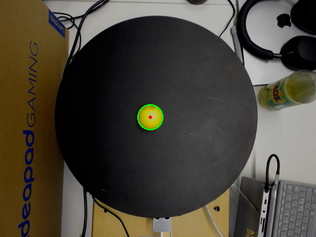
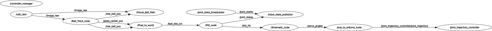

# AIS2105_3DOF
https://github.com/KGKrohn/ais_3dof

Task is to balance a ball using an arduino three servos and a webcamera using ros2.
# cam node
v4l2-ctl --list-devices
ros2 run usb_cam usb_cam_node_exe --ros-args -p video_device:=/dev/video0

# avalable nodes

pub_servo_ang: publish servo angles to surface

sim: run sim

kin_calc: kinematic node

test_prg: test kinematic

pid: pid controller

ball_tracking: tracking ball with cv2

visualiser: Vizualise ball path

convert_to_centi: camera transofrmaton

# launch file
ros2 launch ais_3dof nodes.launch.py model:=/home/kristian/workspace/ros2_ws/src/ais_3dof/urdf/three_dof.urdf
